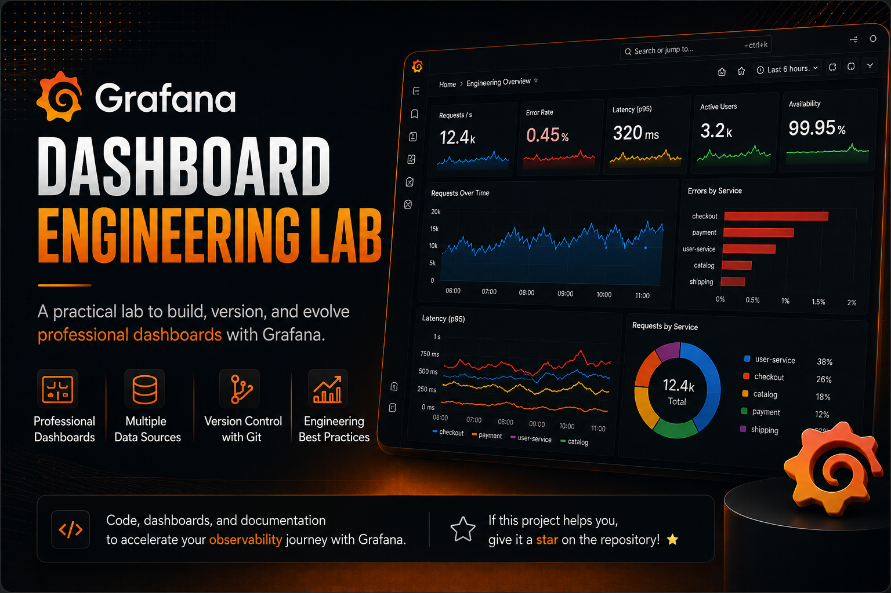
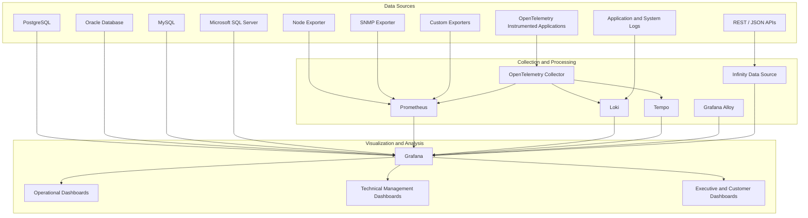

<p align="center">
    
</p>


# Grafana Dashboard Engineering Lab

Hands-on lab for engineering operational, technical, executive, and customer-facing Grafana dashboards using Prometheus, OpenTelemetry, APIs, SQL databases, exporters, and multiple data sources.

---

## Repository structure

```markdown

grafana-dashboard-engineering-lab/
│
├── README.md
├── roadmap.md
├── LICENSE
├── .gitignore
│
├── docs/
│   ├── dashboard-design-guidelines.md
│   ├── dashboard-review-checklist.md
│   ├── naming-conventions.md
│   ├── visualization-selection-guide.md
│   ├── executive-dashboard-principles.md
│   └── repository-architecture.md
│
├── templates/
│   ├── lab-readme-template.md
│   ├── dashboard-requirements-template.md
│   ├── dashboard-review-template.md
│   └── executive-summary-template.md
│
├── shared/
│   ├── provisioning/
│   ├── datasources/
│   ├── dashboards/
│   ├── sample-data/
│   └── scripts/
│
├── labs/
│   ├── 01-grafana-dashboard-design-fundamentals/
│   │   ├── README.md
│   │   ├── images/
│   │   │   ├── dashboard-overview.png
│   │   │   ├── panel-comparison.png
│   │   │   └── final-dashboard.png
│   │   ├── dashboards/
│   │   │   └── dashboard.json
│   │   ├── provisioning/
│   │   │   ├── dashboards.yml
│   │   │   └── datasources.yml
│   │   ├── queries/
│   │   ├── sample-data/
│   │   ├── scripts/
│   │   └── docker-compose.yml
│   │
│   └── 02-linux-infrastructure-dashboard/
│       ├── README.md
|       │
|       ├── images/
|       |   └── .gitkeep
|       │
|       ├── dashboards/
|       │   └── linux-infrastructure-dashboard.json
|       │
|       ├── prometheus/
|       │   └── prometheus.yml
|       │
|       └── queries/
|           └── promql.md
│
└── .github/
    ├── ISSUE_TEMPLATE/
    ├── pull_request_template.md
    └── workflows/
        ├── validate-dashboard-json.yml
        └── markdown-lint.yml

```


---


## Internal structure of each laboratory

Each laboratory will operate as an independent project. An example follows below:

```markdown

labs/02-linux-infrastructure-dashboard/
├── README.md
├── images/
├── dashboards/
│   └── linux-infrastructure-dashboard.json
├── provisioning/
│   ├── dashboards.yml
│   └── datasources.yml
├── prometheus/
│   └── prometheus.yml
├── queries/
│   └── promql-examples.md
├── alerting/
│   └── alert-rules.yml
├── scripts/
│   └── generate-load.sh
└── docker-compose.yml

```


---


---

## Architecture




---

## 📈 Repository Metrics

<p align="center">

<a href="https://info.flagcounter.com/fvOS"></a>

</p>
