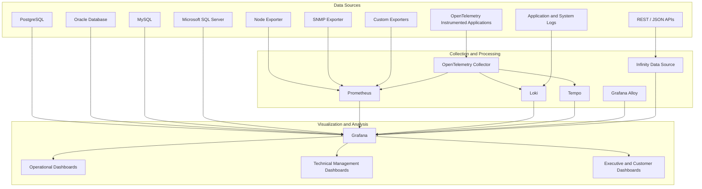

# grafana-dashboard-engineering-lab
Hands-on lab for engineering operational, technical, executive, and customer-facing Grafana dashboards using Prometheus, OpenTelemetry, APIs, SQL databases, exporters, and multiple data sources.

---

## Roadmap

## Phase 1 — Dashboard Engineering Fundamentals

### LAB 01 — Grafana Dashboard Design Fundamentals

- visual hierarchy;
- panel selection;
- units;
- thresholds;
- variables;
- information organization;
- common errors;
- operational vs. executive dashboards.

---

## Architecture

---

## 📈 Repository Metrics

