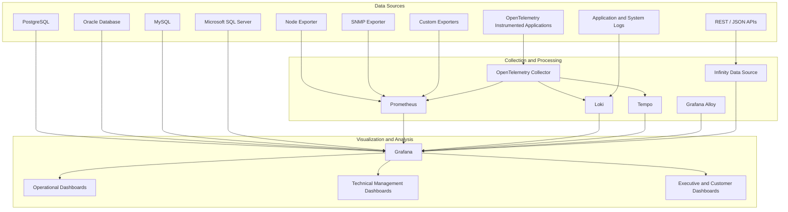

# grafana-dashboard-engineering-lab
Hands-on lab for engineering operational, technical, executive, and customer-facing Grafana dashboards using Prometheus, OpenTelemetry, APIs, SQL databases, exporters, and multiple data sources.

---

## Roadmap

## Phase 1 — Dashboard Engineering Fundamentals

### LAB 01 — Grafana Dashboard Design Fundamentals

- visual hierarchy;
- panel selection;
- units;
- thresholds;
- variables;
- information organization;
- common errors;
- operational vs. executive dashboards.

### LAB 02 — Linux Infrastructure Dashboard

- Node Exporter;
- Prometheus;
- CPU;
- memory;
- disk;
- network;
- availability;
- capacity.

### LAB 03 — Executive Infrastructure Dashboard

Using the same data from LAB 02, but transformed into:

- overall health index;
- capacity trend;
- risks;
- availability;
- key exceptions;
- executive summary.

---

## Phase 2 — Networks, devices, and infrastructure

### LAB 04 — SNMP Network Dashboard

- devices;
- interfaces;
- utilization;
- errors;
- availability;
- latency;
- capacity.

### LAB 05 — Smart PDU and Energy Dashboard

- consumption;
- power;
- demand;
- energy density;
- efficiency;
- anomalies;
- estimated cost;
- available capacity.

### LAB 06 — Infrastructure Comparison Dashboard

Comparison between two environments:

- legacy vs. modern;
- on-premises vs. cloud;
- centralized vs. distributed architecture;
- before vs. after.

---

## Phase 3 — APIs and applications

### LAB 07 — REST API and JSON Dashboard

- Public or custom API;
- Infinity;
- authentication;
- JSON transformation;
- handling missing data;
- external indicators.

### LAB 08 — FastAPI Application Dashboard

- requests;
- P50/P95/P99 latency;
- errors;
- throughput;
- availability;
- most used endpoints.

### LAB 09 — Custom Prometheus Exporter

- Python exporter;
- custom metrics;
- integration with Prometheus;
- visualization in Grafana.

### LAB 10 — OpenTelemetry Application Dashboard

- metrics;
- logs;
- traces;
- correlation between signals;
- technical view and executive view.

---

## Phase 4 — Databases and business indicators

### LAB 11 — PostgreSQL Business Dashboard

- sales, operations, or customer service;
- SQL queries;
- indicators by period;
- targets;
- trends;
- comparisons.

## LAB 12 — MySQL or MariaDB Dashboard

- relational source;
- queries;
- variables;
- filters;
- operational indicators.

## LAB 13 — Microsoft SQL Server Dashboard

- business data;
- departmental indicators;
- direct integration.

---

## Architecture

---

## 📈 Repository Metrics

