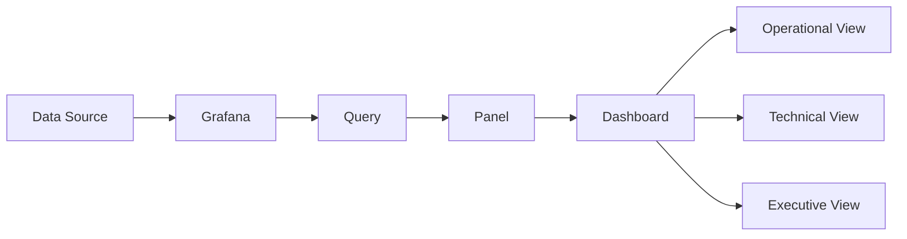

# Lab 01 — Grafana Dashboard Design Fundamentals

## Overview

This laboratory introduces the fundamental concepts required to design and build dashboards with Grafana.

Instead of starting with a complex production monitoring environment, this lab focuses on understanding how Grafana dashboards are structured and how raw data can be transformed into useful visual information.

The laboratory follows a practical, step-by-step approach intended for engineers and developers who are beginning their journey with Grafana.

By the end of the lab, we will build our first complete dashboard and understand the basic design decisions behind it.

---

## Objectives

By completing this laboratory, you will learn how to:

- Understand the Grafana interface
- Understand the basic structure of a Grafana dashboard
- Configure a data source
- Create a new dashboard
- Create and configure panels
- Select appropriate visualization types
- Configure titles, units, thresholds, and legends
- Organize panels into a readable dashboard
- Understand basic dashboard design principles
- Export a dashboard as JSON
- Store Grafana dashboards in a Git repository

---

## What We Will Build

The goal of this laboratory is to create a simple infrastructure monitoring dashboard containing different types of visualizations.

The final dashboard will gradually include panels such as:

| Panel | Visualization | Purpose |
|---|---|---|
| System Status | Stat | Display the current state of the monitored system |
| CPU Usage | Gauge | Display current CPU utilization |
| Memory Usage | Gauge | Display current memory utilization |
| Disk Usage | Bar Gauge | Compare storage utilization |
| Request Rate | Time Series | Observe changes over time |
| System Metrics | Table | Display detailed metric information |

The purpose is not to create a production monitoring platform yet.

The focus is learning **how Grafana dashboards are designed and constructed**.

More advanced infrastructure monitoring will be introduced in later laboratories.

---

# 1. Understanding Grafana

Grafana is an open-source visualization and observability platform used to explore, analyze, and visualize data from multiple sources.

Grafana does not normally generate monitoring data itself.

Instead, it connects to external data sources such as:

- Prometheus
- PostgreSQL
- MySQL
- Microsoft SQL Server
- Loki
- Elasticsearch
- InfluxDB
- APIs
- Cloud monitoring platforms
- Other supported data sources

Grafana then allows us to transform this data into dashboards.

A simplified architecture looks like this:



This distinction is important:

> Grafana is primarily the visualization layer.  
> The data usually comes from another system.

---

# 2. Understanding the Grafana Dashboard Structure

A Grafana dashboard is composed of several elements.

```text
Grafana
│
└── Dashboard
    │
    ├── Row
    │   │
    │   ├── Panel
    │   ├── Panel
    │   └── Panel
    │
    ├── Row
    │   │
    │   ├── Panel
    │   └── Panel
    │
    └── Variables
```

The most important component is the **panel**.

Each panel normally contains:

```text
Data Source
     │
     ▼
   Query
     │
     ▼
Transformation
     │
     ▼
Visualization
     │
     ▼
   Panel
```

Understanding this pipeline is one of the foundations of Grafana dashboard engineering.

---

# 3. Laboratory Architecture

For this first laboratory, we will use a small local environment.

The repository already provides the structure required to evolve the lab:

```text
01-grafana-dashboard-design-fundamentals/
│
├── README.md
│
├── docker-compose.yml
│
├── dashboards/
├── images/
├── provisioning/
├── queries/
├── sample-data/
└── scripts/
```

Each directory has a specific purpose.

| Directory | Purpose |
|---|---|
| `dashboards/` | Exported Grafana dashboard JSON files |
| `images/` | Screenshots used in this documentation |
| `provisioning/` | Grafana automatic provisioning configuration |
| `queries/` | Queries used by dashboard panels |
| `sample-data/` | Example datasets used by the laboratory |
| `scripts/` | Supporting automation scripts |

This structure allows each laboratory to behave as an independent mini-project.

---

# 4. Prerequisites

Before starting this laboratory, make sure the following tools are available:

- Git
- Docker Desktop
- Docker Compose
- A modern web browser
- Visual Studio Code or another code editor

Verify Docker:

```bash
docker --version
```

Verify Docker Compose:

```bash
docker compose version
```

If both commands return their installed versions, the environment is ready for the next step.


---

# 5. Starting the Laboratory Environment

Open a terminal inside:

```text
labs/01-grafana-dashboard-design-fundamentals/
```

Start the environment with:

```bash
docker compose up -d
```

Check the running containers:

```bash
docker compose ps
```

Once Grafana is running, open the local Grafana interface in your browser.

The exact configuration used by this laboratory is defined in:

```text
docker-compose.yml
```

---

# 6. Accessing Grafana

After the container starts successfully, open Grafana in your browser.

You should see the Grafana login interface.

After authentication, you will reach the Grafana home page.

At this point, take a moment to explore the interface.

Important areas include:

- Dashboards
- Explore
- Connections
- Data sources
- Alerting
- Administration

We will use these sections progressively throughout the repository.

---

# 7. Understanding Data Sources

Before Grafana can display useful information, it needs access to data.

This connection is called a **data source**.

Examples include:

```text
Prometheus ────────┐
PostgreSQL ────────┤
MySQL ─────────────┤
REST APIs ─────────┤
Loki ──────────────┤──> Grafana
OpenTelemetry ─────┤
CloudWatch ────────┤
InfluxDB ──────────┘
```

Different laboratories in this repository will explore several of these integrations.

For this introductory lab, we will keep the data source intentionally simple so that we can focus on dashboard construction.

---

# 8. Creating the First Dashboard

Inside Grafana:

1. Open **Dashboards**
2. Select **New**
3. Select **New dashboard**
4. Click **Add visualization**

Grafana will ask which data source should be used.

After selecting the data source, the panel editor will open.

This editor is one of the most important interfaces in Grafana.

---

# 9. Understanding the Panel Editor

A panel combines three fundamental elements:

```text
Query
  +
Visualization
  +
Configuration
  =
Panel
```

The query determines **what data we retrieve**.

The visualization determines **how the data is presented**.

The configuration determines **how the information should be interpreted**.

Typical configuration options include:

- Title
- Description
- Unit
- Minimum value
- Maximum value
- Thresholds
- Colors
- Legend
- Tooltip

A technically correct query can still produce a poor dashboard if the visualization is inappropriate.

Dashboard engineering therefore requires both technical and visual decisions.

---

# 10. Creating a Stat Panel

Our first visualization will be a **Stat** panel.

Stat panels are useful when the user needs to immediately identify a single important value.

Examples include:

- Current availability
- Active servers
- Current CPU utilization
- Current memory utilization
- Number of requests
- Number of incidents

Create the panel and select:

```text
Visualization → Stat
```

Give the panel a meaningful title.

Example:

```text
System Status
```

Avoid generic names such as:

```text
Panel 1
Metric
Value
Test
```

A dashboard should communicate clearly without requiring the user to understand the underlying query.

---

# 11. Creating a Gauge

Next, create another panel and select:

```text
Visualization → Gauge
```

Gauges are useful when a value must be interpreted relative to a known range.

For example:

```text
CPU Usage

0% ---------------------------- 100%
```

Configure:

```text
Unit: Percent
Minimum: 0
Maximum: 100
```

Later laboratories will use real infrastructure metrics to populate these panels.

---

# 12. Creating a Time Series

Time series visualizations are among the most important tools in observability.

They allow us to understand how a metric changes over time.

Examples include:

- CPU utilization
- Memory consumption
- Network traffic
- HTTP requests
- Response latency
- Error rate

Create another panel and select:

```text
Visualization → Time series
```

A time series allows us to answer questions such as:

> Is CPU usage increasing?

> When did the error rate begin to rise?

> Was there a traffic spike before the incident?

> Is system behavior stable over time?

This is one of the reasons time-based visualization is fundamental in monitoring environments.

---

# 13. Choosing the Correct Visualization

Different questions require different visualizations.

| Question | Recommended visualization |
|---|---|
| What is the current value? | Stat |
| Is the value approaching a limit? | Gauge |
| How has the metric changed over time? | Time Series |
| How do several values compare? | Bar Gauge |
| What are the detailed values? | Table |
| How is a total divided among categories? | Pie Chart |

A common dashboard design mistake is selecting a visualization because it looks attractive rather than because it communicates the data effectively.

The first question should always be:

> What question should this panel answer?

Only after answering that question should the visualization be selected.

---

# 14. Dashboard Layout

Panels should not be positioned randomly.

A useful dashboard usually follows an information hierarchy.

For example:

```text
┌─────────────────────────────────────────────────────┐
│                  SYSTEM OVERVIEW                    │
├───────────────┬───────────────┬─────────────────────┤
│ System Status │   CPU Usage   │    Memory Usage     │
├───────────────┴───────────────┴─────────────────────┤
│                                                     │
│                 REQUEST RATE                        │
│                                                     │
├─────────────────────────────────────────────────────┤
│                                                     │
│                 SYSTEM METRICS                      │
│                                                     │
└─────────────────────────────────────────────────────┘
```

Important information should normally appear near the top.

Detailed information can appear further down.

This allows the dashboard to support progressive analysis:

```text
Overview
   ↓
Health
   ↓
Trends
   ↓
Details
```

---

# 15. Dashboard Design Principles

Throughout this repository, we will follow several basic principles.

### 1. Every panel should answer a question

A panel without a clear purpose creates visual noise.

### 2. Prefer clarity over decoration

Dashboards are tools for understanding systems.

### 3. Use consistent units

Do not mix incompatible units without a clear reason.

### 4. Use meaningful titles

Good:

```text
CPU Usage
HTTP Request Rate
API Response Time
Database Connections
```

Poor:

```text
Graph 1
Metric
Panel
Test
```

### 5. Avoid unnecessary panels

More panels do not necessarily create a better dashboard.

### 6. Design for the intended audience

An infrastructure engineer and a company executive usually need different information.

This repository will explore dashboards for several audiences.

---

# 16. Saving the Dashboard

After creating the panels:

1. Click **Save dashboard**
2. Choose a descriptive dashboard name

Example:

```text
Grafana Dashboard Design Fundamentals
```

Add a description explaining the purpose of the dashboard.

Example:

```text
Introductory dashboard demonstrating fundamental Grafana
visualization and dashboard design concepts.
```

---

# 17. Exporting the Dashboard

Grafana dashboards can be exported as JSON.

This is important because dashboards can then be:

- Version controlled
- Stored in Git
- Reviewed
- Shared
- Reused
- Automatically provisioned

Export the dashboard and save it inside:

```text
dashboards/
```

Suggested filename:

```text
grafana-dashboard-design-fundamentals.json
```

The repository then contains both the documentation and the actual dashboard implementation.

---

# 18. Dashboard as Code

Once exported, the dashboard becomes part of the repository:

```text
Grafana UI
    │
    │ Export
    ▼
Dashboard JSON
    │
    │ Git commit
    ▼
Git Repository
    │
    │ Version history
    ▼
Reproducible Dashboard
```

This introduces an important engineering concept:

> Dashboards should not exist only inside a Grafana server.

Storing dashboard definitions in Git provides history, reproducibility, reviewability, and portability.

Later laboratories will expand this concept using Grafana provisioning.

---

# 19. Evidence and Documentation

During the laboratory, screenshots should be stored inside:

```text
images/
```

Suggested screenshots:

```text
images/
├── 01-grafana-home.png
├── 02-new-dashboard.png
├── 03-panel-editor.png
├── 04-stat-panel.png
├── 05-gauge-panel.png
├── 06-time-series-panel.png
└── 07-final-dashboard.png
```

Screenshots should demonstrate meaningful milestones rather than every mouse click.

They serve as evidence that the laboratory was actually implemented and tested.

---

# 20. Expected Result

At the end of this laboratory, we should have:

- A working local Grafana environment
- A configured data source
- A functional dashboard
- Multiple visualization types
- A structured dashboard layout
- A basic understanding of panel configuration
- Screenshots documenting the implementation
- An exported dashboard JSON
- A reproducible laboratory stored in Git

---

# 21. Repository Artifacts

After completing the lab, the directory should contain approximately:

```text
01-grafana-dashboard-design-fundamentals/
│
├── README.md
├── docker-compose.yml
│
├── dashboards/
│   └── grafana-dashboard-design-fundamentals.json
│
├── images/
│   ├── 01-grafana-home.png
│   ├── 02-new-dashboard.png
│   ├── 03-panel-editor.png
│   ├── 04-stat-panel.png
│   ├── 05-gauge-panel.png
│   ├── 06-time-series-panel.png
│   └── 07-final-dashboard.png
│
├── provisioning/
│   ├── dashboards.yml
│   └── datasources.yml
│
├── queries/
├── sample-data/
└── scripts/
```

Some directories may remain empty during the first stages of the laboratory.

They are intentionally included because they will support future improvements and more advanced Grafana engineering concepts.

---

# 22. What We Learned

This laboratory introduced the foundations of Grafana dashboard engineering.

We learned that building a dashboard involves more than placing charts on a screen.

A useful dashboard combines:

```text
Data
  +
Query
  +
Visualization
  +
Context
  +
Information Hierarchy
  =
Useful Dashboard
```

We also introduced an important engineering practice:

```text
Dashboard
    ↓
Exported JSON
    ↓
Git Repository
    ↓
Version Control
    ↓
Reproducibility
```

These concepts will serve as the foundation for the remaining laboratories in this repository.

---

# Next Laboratory

## Lab 02 — Linux Infrastructure Dashboard

The next laboratory will move from dashboard design fundamentals to real infrastructure monitoring.

We will begin working with Linux system metrics and build a dashboard capable of visualizing infrastructure behavior.

This will introduce the next stage of the architecture:

```text
Linux Host
    ↓
Metrics Collection
    ↓
Prometheus
    ↓
Grafana
    ↓
Infrastructure Dashboard
```

The concepts learned in Lab 01 will be reused throughout the rest of the repository.
